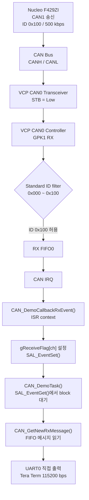
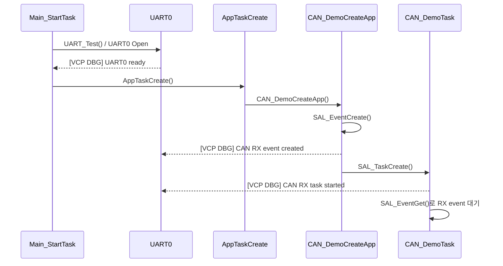

# CAN RX 인터럽트 기반 수신 정리

## 1. 흐름도



### 초기화 흐름



## 2. CAN RX 핵심 코드

### 2-1. 앱 태스크 생성

`sources/app.sample/app.base/main.c`

```c
void Main_StartTask(void *pArg)
{
    (void)pArg;
    (void)SAL_OsInitFuncs();

    UART_Test();
    AppTaskCreate();

    while (1) {
        SAL_TaskSleep(1000);
    }
}
```

`AppTaskCreate()` 내부에서 `CAN_DemoCreateApp()`을 호출해야 CAN RX task가 생성된다.

### 2-2. RX event와 task 생성

`sources/app.sample/app.can.demo/can_demo.c`

```c
void CAN_DemoCreateApp(void)
{
    static uint32 uiCanDemoAppTaskID;
    static uint32 uiCanDemoAppTaskStk[CAN_DEMO_TASK_STK_SIZE];

    if (SAL_RET_SUCCESS == SAL_EventCreate(&gCanDemoRxEvent,
                                           (const uint8 *)"CAN RX Event",
                                           0UL))
    {
        gCanDemoRxEventCreated = TRUE;
        sTestInfo.tiRecv = TRUE;
    }

    (void)SAL_TaskCreate(&uiCanDemoAppTaskID,
                         (const uint8 *)"Can Demo Task",
                         (SALTaskFunc)&CAN_DemoTask,
                         &uiCanDemoAppTaskStk[0],
                         CAN_DEMO_TASK_STK_SIZE,
                         SAL_PRIO_CAN_DEMO,
                         NULL_PTR);
}
```

### 2-3. CAN RX callback (ISR)

ISR에서는 출력이나 긴 처리 없이 수신 표시와 event signal만 수행한다.

```c
static void CAN_DemoCallbackRxEvent(uint8 ucCh,
                                    uint32 uiRxIndex,
                                    CANMessageBufferType_t uiRxBufferType,
                                    CANErrorType_t uiError)
{
    if (uiError == CAN_ERROR_NONE)
    {
        gReceiveFlag[ucCh] = uiRxIndex + 1UL;
        gCanRxCallbackCount[ucCh]++;

        if ((ucCh < CAN_CONTROLLER_NUMBER) &&
            (gCanDemoRxEventCreated == TRUE))
        {
            (void)SAL_EventSet(gCanDemoRxEvent,
                               CAN_DEMO_RX_EVENT(ucCh),
                               SAL_EVENT_OPT_FLAG_SET);
        }
    }

    (void)uiRxBufferType;
}
```

### 2-4. CAN RX task

`SAL_EventGet()`으로 block 상태를 유지하므로 100 ms polling 없이 RX interrupt가 발생했을 때만 실행된다.

```c
static void CAN_DemoTask(void *pArg)
{
    uint8 ucCh;
    uint32 uiRxEvents;
    SALRetCode_t result;

    (void)pArg;

    while (1)
    {
        uiRxEvents = 0UL;
        result = SAL_EventGet(gCanDemoRxEvent,
                              CAN_DEMO_RX_EVENT_MASK,
                              0UL,
                              SAL_EVENT_OPT_SET_ANY |
                              SAL_EVENT_OPT_CONSUME |
                              SAL_OPT_BLOCKING,
                              &uiRxEvents);

        if ((result == SAL_RET_SUCCESS) && (sTestInfo.tiRecv == TRUE))
        {
            for (ucCh = 0U; ucCh < CAN_CONTROLLER_NUMBER; ucCh++)
            {
                if ((uiRxEvents & CAN_DEMO_RX_EVENT(ucCh)) != 0UL)
                {
                    CAN_DemoReceive(ucCh);
                }
            }
        }
    }
}
```

### 2-5. FIFO에서 메시지 읽고 UART0로 출력

```c
uiRxMsgNum = CAN_CheckNewRxMessage(ucCh);

if (uiRxMsgNum > 0UL)
{
    (void)CAN_GetNewRxMessage(ucCh, &sRxMsg);

    iLogLen = snprintf((char *)aucLog, sizeof(aucLog),
                       "[CAN RX] CH%u ID:0x%03lX DLC:%u DATA:",
                       ucCh,
                       (unsigned long)sRxMsg.mId,
                       sRxMsg.mDataLength);

    /* 메시지 data를 문자열로 추가 */

    (void)UART_Write(UART_TEST_CH, aucLog, (uint32)iLogLen);
}
```

## 확인 로그

```text
[VCP DBG] UART0 ready
[VCP DBG] CAN RX event created
[VCP DBG] CAN RX task started
[VCP DBG] CAN RX event
[CAN RX] CH0 ID:0x100 DLC:8 DATA: 01 02 03 04 05 06 07 08
```
